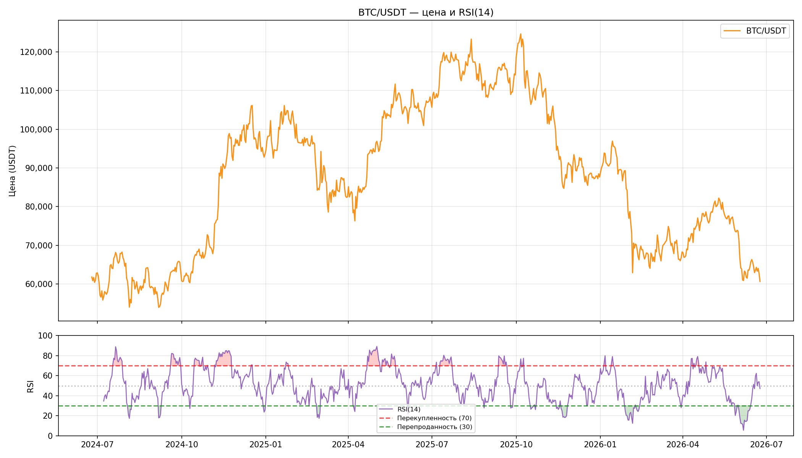
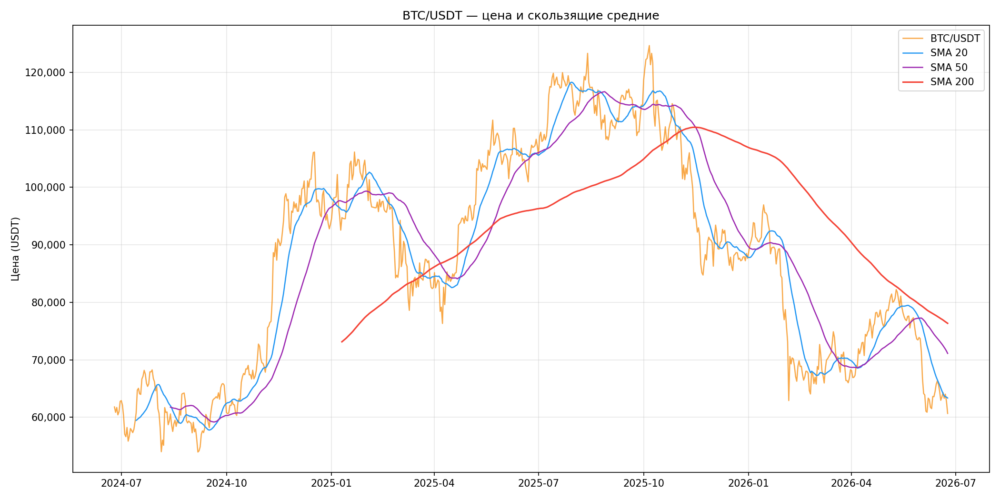
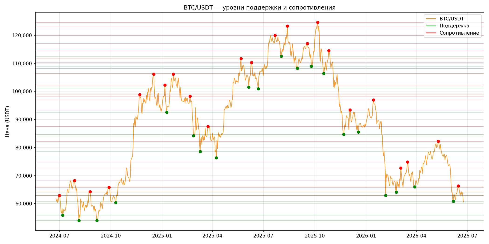
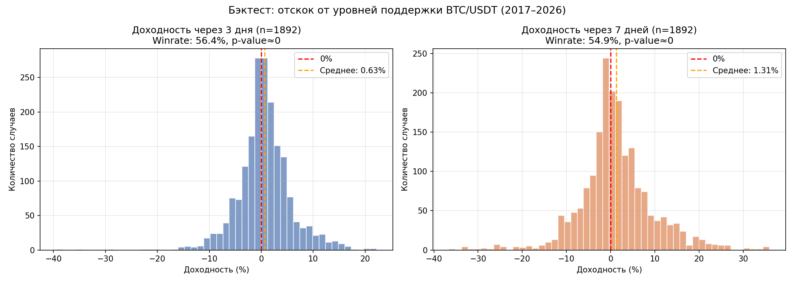
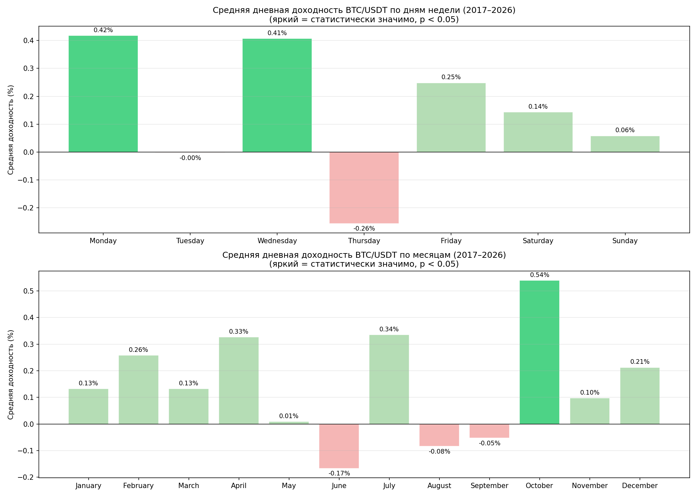
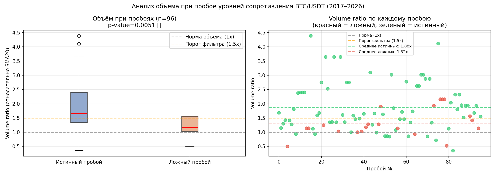

# BTC Market Analysis

Анализ рыночных данных BTC/USDT через биржевой API.  
Цель: выявить рыночные неэффективности и проверить торговые гипотезы на исторических данных.

**Стек:** Python, pandas, NumPy, matplotlib, scipy, ccxt, Jupyter  
**Данные:** Binance REST API через ccxt — 3234 дневных свечи, период 2017–2026 (2 халвинг-цикла)

---

## Структура проекта

btc-market-analysis/

│

├── btc_analysis.ipynb      # Основной ноутбук

├── queries.sql             # SQL запросы (опционально)

├── README.md

└── images/

├── btc_price_volume.png

├── btc_rsi.png

├── btc_sma.png

├── btc_levels.png

├── btc_backtest.png

├── btc_seasonality.png

└── btc_breakout_volume.png

---

## Блок 1 — Сбор и подготовка данных

Данные загружены через Binance REST API с помощью библиотеки **ccxt**.  
Поскольку API возвращает максимум 500 свечей за запрос — реализована пагинация с обходом rate limit.

```python
exchange = ccxt.binance()
# Загрузка частями по 500 свечей с паузой 0.5с между запросами
```

**Результат:** 3234 дневных свечи без пропусков в OHLCV, период август 2017 — июнь 2026.

---

## Блок 2 — Технический анализ

Рассчитаны базовые индикаторы:

- **RSI(14)** — индекс относительной силы
- **SMA 20, 50, 200** — скользящие средние
- **Уровни поддержки и сопротивления** — через локальные экстремумы (scipy.argrelextrema, order=10)





**Наблюдение:** SMA200 работает как долгосрочный трендовый фильтр — в бычьи периоды цена устойчиво держится выше, в медвежьи уходит ниже на недели и месяцы.

---

## Блок 3 — Бэктест: отскок от уровней поддержки

**Гипотеза:** при касании уровня поддержки (±2%) цена статистически значимо растёт в последующие 3 и 7 дней.

**Метод:** для каждого касания уровня поддержки фиксируем доходность через 3 и 7 дней. T-тест против нулевой гипотезы (доходность = 0).

| Период | Выборка | Winrate | Средняя доходность | p-value |
|---|---|---|---|---|
| 2024–2026 (2 года) | 254 | 55.9% | -0.01% | 0.9757 ❌ |
| 2017–2026 (9 лет) | 1892 | 56.4% | +0.63% | ≈0 ✅ |



**Ключевой вывод:** на коротком периоде (2 года) гипотеза не подтверждается — сигнал теряется в шуме. На полной выборке (9 лет, 1892 касания) отскок статистически значим. Это демонстрирует критическую важность размера выборки в бэктестинге.

---

## Блок 4 — Сезонность

Проверена гипотеза о наличии календарных паттернов в доходности BTC.



**Результаты (t-тест, p < 0.05):**

| Паттерн | Среднее | p-value | Значимо |
|---|---|---|---|
| Понедельник | +0.42% | 0.026 | ✅ |
| Среда | +0.41% | 0.018 | ✅ |
| Октябрь | +0.54% | 0.001 | ✅ |

**Вывод:** большинство визуальных паттернов сезонности статистически не значимы. Исключения — понедельник, среда и октябрь («Uptober»). На коротком периоде (2 года) ни один паттерн не подтверждался — снова вопрос выборки.

---

## Блок 5 — Анализ объёма при пробоях уровней сопротивления

**Гипотеза:** ложные пробои уровней сопротивления происходят на статистически меньшем объёме чем истинные.

**Метод:** для каждого пробоя уровня (цена закрылась выше на 1%+) фиксируем volume ratio — объём в день пробоя относительно SMA20. Ложный пробой = цена вернулась ниже уровня через 3 дня.

| | Истинных пробоев | Ложных пробоев |
|---|---|---|
| Количество | 75 | 21 |
| Средний volume ratio | 1.88x | 1.32x |

**t-тест: p=0.005 ✅**



**Вывод:** объём при пробое является значимым фильтром. Пробои с volume ratio ниже 1.5x от нормы значительно чаще оказываются ложными. Практическое применение: использовать объём как дополнительный фильтр при торговле пробоев.

---

## Итог

| Гипотеза | Результат | p-value |
|---|---|---|
| Отскок от поддержки (2 года) | ❌ Не подтверждена | 0.976 |
| Отскок от поддержки (9 лет) | ✅ Подтверждена, +0.63%/3д | ≈0 |
| Сезонность: понедельник | ✅ +0.42% | 0.026 |
| Сезонность: среда | ✅ +0.41% | 0.018 |
| Сезонность: октябрь | ✅ +0.54% | 0.001 |
| Объём при ложных пробоях | ✅ 1.32x vs 1.88x | 0.005 |

**Главный вывод проекта:** размер выборки критичен для бэктестинга. Гипотезы которые не подтверждались на 2 годах данных становятся статистически значимыми на 9-летней истории. Визуальные паттерны без статистической проверки — ловушка для трейдера.
